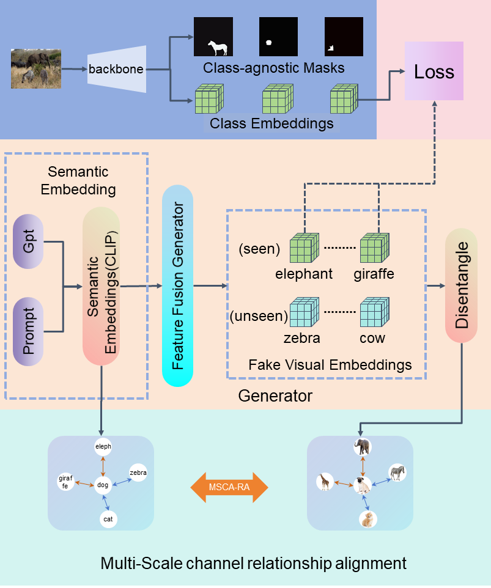

# A unified zero-shot segmentation framework based on GPT-generated features and relationship alignment
[](https://pytorch.org/)
[](https://www.python.org/downloads/)
## Framework:

## Datasets:
### Expected dataset structure:

```
coco
├── coco_stuff
    ├── annotations
    ├── annotations_detectron2
    ├── word_vectors
    └── split
├── train2017
    ├── 000000189148.jpg
    └── ...
├── val2017
    ├── 000000213547.jpg
    └── ...
├── train2014
    ├── COCO_train2014_xxxxxxxxxxxx.jpg
    └── ...
├── val2014
    ├── COCO_val2014_xxxxxxxxxxxx.jpg
    └── ...
├── panoptic_{train,val}2017 # png annotations
├── panoptic_semseg_{train,val}2017 # generated from panoptic annotations
└── annotations
    ├── panoptic_train2017.json
    ├── panoptic_val2017.json
    ├── ZSP
        ├── panoptic_train2017_all.json
        ├── panoptic_train2017_seen.json
        ├── panoptic_train2017_unseen.json
        ├── panoptic_val2017_all.json
        ├── panoptic_val2017_seen.json
        └── panoptic_val2017_unseen.json
    └── ZSIS
        ├── instances_train2014_seen_48_17.json
        ├── instances_train2014_seen_65_15.json
        ├── instances_val2014_gzsi_48_17.json
        ├── instances_val2014_gzsi_65_15.json
        ├── instances_val2014_unseen_48_17.json
        └── instances_val2014_unseen_65_15.json

```
## Panoptic Segmentation

Split json into seen and unseen setting using the following command:

```
python datasets/get_zsp_json.py
```

### Instance Segmentation

Please follow the setting of the [ZSI](https://github.com/zhengye1995/Zero-shot-Instance-Segmentation).

### Semantic Segmentation

Please follow the setting of the [ZegFormer](https://github.com/dingjiansw101/ZegFormer).


## Installation:

The code is tested under CUDA 11.2, Pytorch 1.9.0 and Detectron2 0.6.

1. Install [Detectron2](https://github.com/facebookresearch/detectron2) following the [manual](https://detectron2.readthedocs.io/en/latest/)
2. Run `sh make.sh` under `GPTSegNetZero/modeling/pixel_decoder/ops`
(Note: 1-2 steps you can also follow the installation process of [Mask2Former](https://github.com/facebookresearch/Mask2Former))
3. Install other required packages: `pip install -r requirements.txt`
4. Prepare the dataset following `datasets/README.md`

## Inference

```bash
CUDA_VISIBLE_DEVICES=0 python train_net.py \
    --config-file configs/panoptic-segmentation/GPTSegNetZero.yaml \
    --num-gpus 1 --eval-only \
    MODEL.WEIGHTS [path_to_weights] \
    OUTPUT_DIR [output_dir]
```

## Training

Firstly, download the pretrained weights [here](https://drive.google.com/drive/folders/1ynhW1vc_KpLQC_O1MrSuRt4dn8ZYTwa4?usp=sharing) or you can train vanilla mask2former backbone using seen classes and convert it using the following command:

```bash
python train_net_pretrain.py --config-file configs/panoptic-segmentation/pretrain.yaml --num-gpus 8

python tools/preprocess_pretrained_weight.py --task_name panoptic --input_file panoptic_pretrain/model_final.pth
```

Then train GPTSegNetZero and finetune the last class embedding layer of the trained mask2former model:
```bash
CUDA_VISIBLE_DEVICES=0 python train_net.py  --config-file configs/panoptic-segmentation/GPTSegNetZero.yaml --num-gpus 1 MODEL.WEIGHTS pretrained_weight_panoptic.pth
```
## Acknowledgement

This project is based on [Zegformer](https://github.com/dingjiansw101/ZegFormer), [Mask2Former](https://github.com/facebookresearch/Mask2Former). Many thanks to the authors for their great works!


